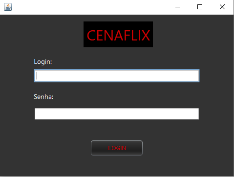
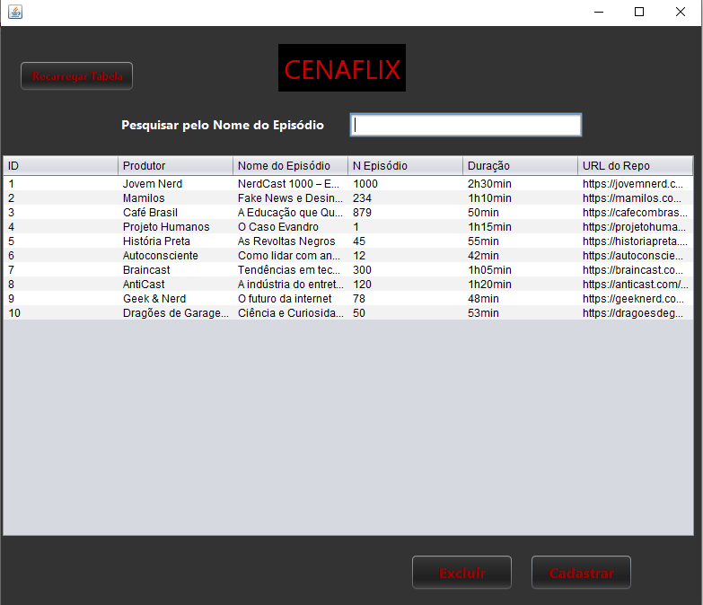
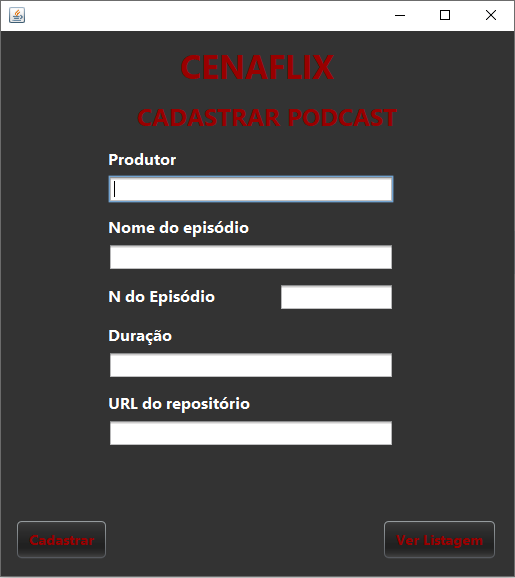
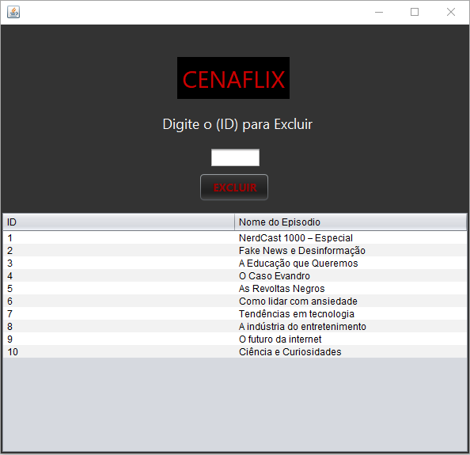

# CenaFlix

## Sobre o Projeto

O CenaFlix é um sistema desktop desenvolvido em Java durante a Unidade Curricular 10 (UC10) do curso Técnico em Desenvolvimento de Software do Senac.

O objetivo do projeto foi praticar conceitos de programação orientada a objetos, desenvolvimento de interfaces gráficas com Java Swing e integração com banco de dados MySQL.

O sistema possui uma tela de login e permite cadastrar, visualizar e excluir podcasts cadastrados no banco de dados.

Este projeto foi desenvolvido para fins educacionais e representa uma das atividades práticas realizadas durante o curso.

## Tecnologias Utilizadas

* Java
* Java Swing
* MySQL
* JDBC
* NetBeans IDE
* Git
* GitHub

## Funcionalidades

* Login de usuários
* Cadastro de podcasts
* Listagem de podcasts
* Exclusão de podcasts
* Armazenamento dos dados em banco de dados MySQL

## Telas do Sistema

### Login



### Lista de Podcasts



### Cadastro de Podcast



### Exclusão de Podcast



## Banco de Dados

Antes de executar o sistema, crie um banco de dados chamado:

```sql
CREATE DATABASE cenaflix;
```

Após criar o banco de dados, execute o script disponível na pasta:

```text
banco/Script_CenaFlixPodcast.sql
```

O script criará as tabelas necessárias para o funcionamento da aplicação.

## Usuários para Teste

Os usuários abaixo foram cadastrados apenas para demonstração das funcionalidades do sistema:

| Login         | Senha    | Tipo          |
| ------------- | -------- | ------------- |
| admin_master  | admin123 | ADMINISTRADOR |
| joao_operador | op123    | OPERADOR      |
| maria_usuario | user123  | USUARIO       |

## Melhorias Futuras

Algumas melhorias que podem ser implementadas futuramente:

* Criptografia de senhas
* Utilização de hash para autenticação
* Pesquisa de podcasts
* Melhorias na interface gráfica
* Adaptação da interface para diferentes tamanhos de janela

## Observações

Este projeto foi desenvolvido durante o curso Técnico em Desenvolvimento de Software do Senac com o objetivo de praticar os conhecimentos adquiridos em Java, banco de dados e desenvolvimento de aplicações desktop.

## Autor

Matheus Silva Melo
